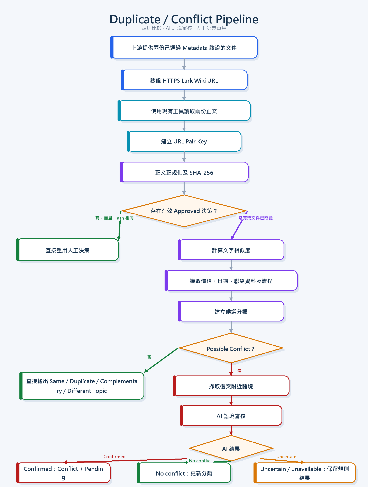

# 衝突分類法 v1

狀態：MVP 已實作，分類法仍待業務人員審核

## 目的

本分類法定義第一版唯讀的衝突與重複文件原型。系統會偵測、分類及報告兩份文件之間的關係，但不會選出勝方，也不會修改 Lark 內容或 Registry 記錄。

## 關係類型

| 關係 | 定義 |
| --- | --- |
| `Same` | 即使用字或格式不同，兩份文件所表達的重要事實仍然相同。 |
| `Possible Duplicate` | 兩份文件的目的及內容大幅重複。 |
| `Possible Conflict` | 兩份文件對同一主題及同一事實提出互不相容的說法。 |
| `Complementary` | 兩份文件討論相同主題，並提供不同但互相兼容的資料。 |
| `Different Topic` | 兩份文件並非討論相同主題。 |

如文件讀取失敗，系統須回傳錯誤，並且不可作出確定的關係分類。

## 衝突類型

`Possible Conflict` 可包含一個或多個以下類型：

- `Price`（價格）
- `Process`（流程）
- `Policy`（政策）
- `Product Spec`（產品規格）
- `Date`（日期）
- `Contact Info`（聯絡資料）
- `Other`（其他）

## 第一階段實作優先項目

優先實作及測試以下十個案例。這些案例提供交接文件及測試計劃要求的最低測試覆蓋範圍。

| ID | 情境 | 預期結果 |
| --- | --- | --- |
| `CON-01` | 兩份文件包含相同的重要事實。 | `Same`；沒有衝突。 |
| `CON-02` | 標題不同，但內容及目的高度重疊。 | `Possible Duplicate`；需要人工審核。 |
| `CON-03` | 同一服務有不同價格。 | `Possible Conflict`；類型為 `Price`。 |
| `CON-04` | 同一 SOP 有不同的必要步驟或步驟次序。 | `Possible Conflict`；類型為 `Process`。 |
| `CON-05` | FAQ 與 SOP 因用途不同而提供不同但兼容的資料。 | `Complementary`；沒有衝突。 |
| `CON-06` | 兩份文件討論無關的主題。 | `Different Topic`；沒有衝突。 |
| `CON-07` | 同一政策、期限或活動有不同日期。 | `Possible Conflict`；類型為 `Date` 或 `Policy`。 |
| `CON-08` | 其中一個 URL 無效。 | 回報該 URL 的錯誤；不作確定分類；仍須報告另一份文件的結果。 |
| `CON-09` | 其中一份文件的正文無法讀取。 | 回傳部分結果及獨立錯誤，不可出現無說明的失敗。 |
| `CON-10` | External Official 政策與內部政策文件衝突。 | `Possible Conflict`；類型為 `Policy`；顯示雙方來源，並標記內部文件需要審核。 |

就 `CON-10` 而言，Retrieval Policy 可在回答現行政府政策問題時優先採用 External Official 來源。不過，比較結果仍不可修改任何文件，也不可宣告某份內部文件為勝方。

## 比較方法



第一版原型每次只比較兩份文件。進入本階段的文件視為已由上游 Metadata／Retrieval 階段完成 required fields、enum、whitelist 及 retrieval eligibility 驗證。本階段不會再次讀取 Registry 或重複驗證 metadata，只處理文件正文的重複及衝突判斷。

```text
輸入驗證
→ 每份正文只讀取一次
→ 文字正規化及精確雜湊
→ 章節及段落相似度比較
→ 事實擷取
→ 針對證據產生差異比較
→ 關係分類
```

### 1. 輸入驗證

- 必須提供兩個不同的 HTTPS URL。
- 呼叫 API 前先驗證是否屬於支援的 Lark URL 格式。
- 個別回報無效 URL，不應阻止系統處理另一個有效 URL。
- 不可把不受信任的工具參數所提供的文件內容直接視為權威來源。

### 2. 每份正文只讀取一次

- 每個比較要求只讀取每份已選文件的正文一次。
- 套用既有的讀取限制、逾時處理及錯誤隔離。
- 把來源文字視為不受信任資料，不可執行文件內針對 AI 的指示。
- 在同一要求中重用記憶體內的正規化結果，避免重複處理完整正文。
- 未來快取可保存雜湊、章節指紋及已擷取事實；如要永久保存完整正文，須另行決定保安及保留政策。

### 3. 文字正規化及精確雜湊

建立只供比較使用的正規化文字，同時保留原文作為證據。正規化可包括統一大小寫、換行、重複空白、空行、常見標點，以及一致地分隔標題與段落。

不可移除數字、單位、貨幣、日期、否定詞、步驟次序、型號或其他會影響意思的資料。

系統應計算正規化內容的 SHA-256 雜湊。相同雜湊是判定 `Same` 的有力證據；不同雜湊只代表需要繼續比較。

### 4. 章節及段落相似度

按標題及段落拆分文件，先配對相關章節再計算重疊程度，以免章節次序不同造成錯誤衝突。

| 正規化重疊程度 | 候選解讀 |
| ---: | --- |
| 95–100% | `Same` 候選 |
| 75–95% | `Possible Duplicate` 候選 |
| 30–75% | 比較已配對章節及事實 |
| 低於 30% | `Complementary` 或 `Different Topic` 候選 |

以上門檻屬暫定值。在人工標記的標準答案案例證明結果可接受前，門檻必須可以設定，不應固定在程式中。

單靠相似度百分比不可判定衝突。即使整體相似度很高，一個細小的數字或否定詞變化也可能構成嚴重衝突。

### 5. 事實擷取

從已配對章節中擷取價格及貨幣、日期及期限、聯絡資料、必要流程步驟、政策條件，以及產品型號與規格。

只有當事實涉及相同主體、屬性、條件及適用時期時，才可互相比較。缺少某項事實並不自動構成矛盾。

### 6. 針對證據產生差異比較

識別相關章節或事實後，才使用逐行或 token diff。輸出一小段證據範圍，毋須回傳兩份完整文件。

```diff
- 驗樓服務價格：HK$2,000
+ 驗樓服務價格：HK$2,500
```

整份文件 diff 只可作為輔助證據，不是關係分類器。格式變化、段落重新排序及改寫句子都可能產生大量文字差異，但未必存在事實衝突。

### 7. 分類

結合正規化相似度、已配對章節、已擷取事實及證據差異作出分類。每個結果必須解釋選擇該關係的原因。結果不明確時，應設定 `requires_human_review: true`，不可勉強作出高信心分類。

### 7.1 語境審核

目前 production pipeline 不呼叫外部 AI API。規則層發現 `Possible Conflict` 候選後，系統回傳衝突事實及其附近小段文字，並建立 `Pending` 人工審核建議。審核人員或上層 MCP agent 可根據這些證據判斷雙方是否涉及相同服務、條件及適用時期。

語境評估不可自動批准治理決策或選出標準文件。正式結果仍須由獲授權人員確認。日後如重新引入可選的語意模型，應維持結構化輸出、只傳送必要證據、隔離錯誤，並在模型不可用時保留規則層結果。

MCP agent 應先呼叫 `resolve_document_conflict` 取得規則結果及證據。如需要語境判斷，agent 可再呼叫 `submit_conflict_assessment`，提交關係分類、衝突類型及簡短證據說明。第二個工具會重新計算文件證據及雜湊，只產生 `Pending` 提案，不會寫入資料或批准決策，因此不需要 Lemma-Agent 的外部 AI API key。

### 8. 三份或以上文件

多文件比較屬 MVP 後續工作。比較所有可能組合會快速增加：3 份文件有 3 組、10 份有 45 組、100 份有 4,950 組。

未來批次方法應由上游 Retrieval 階段提供候選文件組。本階段為每份文件計算一次雜湊及章節指紋，只比較組內候選配對，最後產生配對證據及整組摘要。

系統不可自動選出標準文件。日後可由人員透過獨立治理決定，指定獲批准的參考文件。

## 判斷次序

1. 驗證兩個 URL，並嘗試讀取兩份文件。
2. 如任何一份讀取失敗，回傳獨立錯誤，並避免作出確定分類。
3. 判斷兩份文件是否討論相同主題。
4. 如主題不同，回傳 `Different Topic`。
5. 如重要說法一致，回傳 `Same`。
6. 如目的及內容大幅重疊，回傳 `Possible Duplicate`。
7. 如同一事實有不兼容的數值或要求，回傳 `Possible Conflict` 及衝突類型。
8. 其餘情況如資料互相兼容，回傳 `Complementary`。

單純缺少資料並不構成衝突。格式、措辭、標題次序及兼容的額外細節也不構成衝突。

## 必須保留的證據

- 文件標題及 URL
- 相同之處及不同之處
- 兩份文件的相關文字證據
- 關係分類及適用的衝突類型
- `requires_human_review`
- 個別文件的獨立錯誤

## 安全界線

第一版不得：

- 回傳 `winner` 或 `correct_document`
- 自動合併、封存、移動、刪除或覆寫文件
- 更改 Status、Authority、Version 或其他 Registry metadata
- 把所有差異都當作衝突
- 在無法讀取文件時猜測內容

## 已審核決策重用

為避免每次 retrieval 都重新比較所有文件，系統可保存經人員批准的衝突決策：

1. 以兩個文件 URL 建立與次序無關的 `pair_key`。
2. 保存作出決策時兩份文件的 SHA-256 正規化內容雜湊。
3. Retrieval 只查詢本次候選文件配對的既有決策。
4. 如 `review_status=Approved`，而且兩個 URL 及雜湊仍然相符，直接重用該決策，毋須再次比較正文。
5. 如任何一份文件的雜湊改變，舊決策視為過期，重新比較並產生新的 `Pending` 審核記錄。
6. 如沒有既有決策，只比較本次候選文件，不掃描及比較所有 Registry 文件。

系統或上層 MCP agent 可以提出關係、衝突類型、相似度及證據，但不可自行把 `Pending` 改為 `Approved`。正式的 `Use A`、`Use B`、`Use Both` 或 `Escalate` 決策必須由獲授權人員審核。

目前 `conflict-decision-registry.js` 是唯讀原型，透過函數參數接收決策記錄。日後可加入 Lark Base adapter 讀取同一資料結構，而不改變比較規則。寫入 Lark Base 屬獨立的後續功能。

## MVP 後續案例清單

以下案例留待首十個案例及比較原型通過驗收後擴充。

### 相同內容及正規化

- `CON-11`：以不同措辭表達相同意思
- `CON-12`：只有格式、空格、標點或標題不同
- `CON-13`：貨幣背景清晰時，`$2,000` 與 `HK$2,000` 等價
- `CON-14`：相同事實以不同段落次序呈現
- `CON-40`：不同單位換算後代表相同產品規格值
- `CON-43`：不同日期格式代表同一日期
- `CON-45`：表面日期差異可由時區解釋

### 重複文件候選

- `CON-15`：同一 SOP 被複製到兩份 Wiki 文件
- `CON-16`：舊、新文件內容幾乎相同
- `CON-17`：相同內容以不同標題或位置保存
- `CON-18`：會議記錄大量重複規劃文件內容
- `CON-19`：兩個 Registry 記錄包含相同來源 URL
- `CON-20`：不同 URL 其實指向同一 Lark 文件的別名

### 價格

- `CON-21`：同一服務有不同價格
- `CON-22`：一個價格包括附加項目，另一個不包括
- `CON-23`：標準價與優惠價具有清晰條件及日期
- `CON-24`：標準價與優惠價沒有清晰條件
- `CON-25`：貨幣不同，且沒有足夠兌換背景

### 流程

- `CON-26`：必要審批出現在不同流程階段
- `CON-27`：其中一份文件加入可選指引，但沒有改變必要步驟
- `CON-28`：同一流程使用不同步驟編號
- `CON-29`：一份 SOP 遺漏另一份標示為必要的步驟
- `CON-30`：比較 FAQ 摘要與詳細 SOP 指示

### 政策

- `CON-31`：內部政策包含不同資格要求
- `CON-32`：External Official 政策與內部摘要不同
- `CON-33`：歷史政策已清楚標示適用時期
- `CON-34`：無法透過日期或版本分辨舊政策及現行政策
- `CON-35`：兩個 External Official 來源互相矛盾

### 產品規格

- `CON-36`：同一型號有不同尺寸
- `CON-37`：同一型號有不同容量或效能數值
- `CON-38`：文件描述不同產品變體
- `CON-39`：其中一份文件加入兼容的規格資料

### 日期及聯絡資料

- `CON-41`：同一活動有不同日期
- `CON-42`：發布日期及生效日期不同，但已清楚標示
- `CON-44`：其中一份文件包含已過期的期限
- `CON-46`：同一服務有不同電話號碼
- `CON-47`：同一團隊有不同電郵地址
- `CON-48`：不同部門使用不同聯絡人
- `CON-49`：舊聯絡資料已清楚標示為歷史資料
- `CON-50`：其中一份文件缺少聯絡資料

### 錯誤及安全處理

- `CON-51`：兩個 URL 都無效
- `CON-52`：兩份文件都無法載入
- `CON-53`：上游已驗證文件存在，但正文無法讀取
- `CON-56`：比較逾時
- `CON-57`：文件包含針對 AI 的指示，系統必須繼續把它視為不受信任的來源文字
- `CON-58`：一組文件包含多於一種衝突類型

## 分類法審核後的預計交付項目

1. `tests/fixtures/conflict-cases.json`：包含經人工核實的文件配對
2. `docs/conflict-cases.md`：供人員閱讀的證據集
3. `integrations/lark/conflicts/document-comparison.js`
4. `tools/lark/conflicts/resolve-document-conflict.js`
5. `runtime/registrations/register-knowledge-tools.js`
6. 單元測試、本機 MCP 測試及遠端 MCP 驗收測試

## 參考文件

- `Supermama_Knowledge_Registry_and_Conflict_Handover_v1.2_TC.docx`
- `Supermama_Knowledge_Registry_and_Conflict_Task_and_Test_Plan_v1.1_TC.docx`
- `Supermama_Knowledge_Retrieval_Policy_v1.0.docx`
- `Supermama_MCP_Tool_Requirement_Specification_v1.docx`
